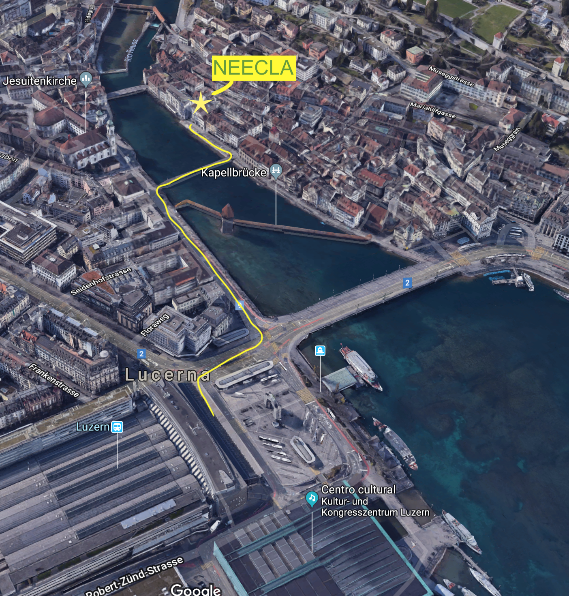

  

----

### Palestras públicas

  

Toda segunda-feira às 19h30.*

Antes das palestras, entre 18h45 e 19h15, é aplicada a fluidoterapia (terapia de passes). 

Todos estão convidados a participarem das nossas palestras e fluidoterapia!

\* Na primeira segunda-feira do mês a palestra é em Alemão.

  

----

### Onde estamos

  

#### *Endereço*: Unter der Egg 10 (3. OG), 6004 Luzern ([Mapa](https://goo.gl/maps/tvAV9rg82En)).

  

  

----

### Contato

  

neeclaluzern@gmail.com

Facebook: [https://www.facebook.com/profile.php?id=100009620982703](https://www.facebook.com/profile.php?id=100009620982703)

  

----
